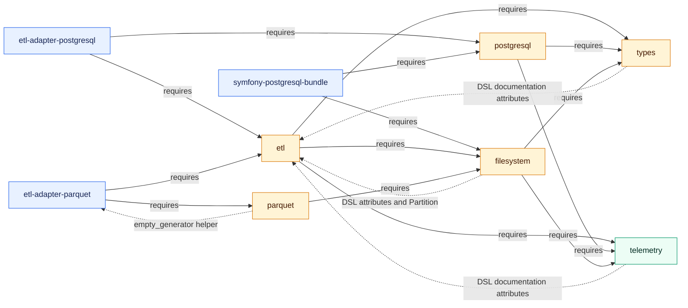

# Artifact 2 - Structure

Status: working report.
Generated: 2026-06-18.
Scope: PHP-native structure pass for the active areas from `context/map/artifact-1-territory.md`.

## Method

The requested prompt mentioned dependency-cruiser, but this checkout is a PHP monorepo. Dependency-cruiser is mainly useful for JavaScript and TypeScript module graphs, so it is not the right primary tool for this repository.

This report uses PHP-native structural signals instead:

- Composer manifests: root `composer.json` plus package-level `composer.json` files.
- Local package `require` edges between `flow-php/*` packages.
- Root PSR-4 and `autoload.files` declarations.
- Source-level `use` statement scan in the active areas from `artifact-1-territory.md`.

Important caveat: the source-level scan is a lightweight namespace/import pass, not a PHP AST/type-resolution pass. Counts below are counts of `use` statements grouped by area. They are useful for finding structural pressure, but they are not a full call graph.

## Top Observations

1. The Composer package graph is acyclic for local `flow-php/*` runtime dependencies. Package-level boundaries are mostly clear.
2. `flow-php/etl` is the main package hub. It has 19 incoming local runtime dependencies and is required by nearly every ETL adapter, the CLI, the website, the parquet viewer, and one telemetry bridge.
3. `flow-php/types`, `flow-php/telemetry`, `flow-php/postgresql`, and `flow-php/filesystem` are the most important support hubs behind ETL.
4. Source-level edges show tighter coupling than Composer manifests expose. The strongest active edge is `core/etl -> lib/types`, with 357 production `use` statements in the scanned hot areas.
5. The main structural risk is not package-level cycles. It is small but meaningful source-level bidirectionality caused by DSL/documentation attributes and helper functions, especially between ETL and `types`, `filesystem`, and `telemetry`.

## Package Structure

The checkout contains 61 Composer manifests:

- 51 package manifests under `src/`.
- 1 root aggregate package: `flow-php/flow`.
- 7 tool manifests under `tools/*`.
- 2 web manifests under `web/landing`.

Product families under `src/`:

| Family | Count | Role |
| --- | ---: | --- |
| Core | 1 | `flow-php/etl`, the main ETL API and runtime abstractions. |
| Adapters | 14 | ETL adapters for Avro, ChartJS, CSV, Doctrine, Elasticsearch, Excel, Google Sheet, HTTP, JSON, Logger, Parquet, PostgreSQL, Text, and XML. |
| Libraries | 11 | Types, telemetry, filesystem, PostgreSQL, parquet, parquet-viewer, array-dot, azure-sdk, doctrine-dbal-bulk, dremel, snappy. |
| Bridges | 22 | Symfony, PSR, Monolog, OpenAPI, PHPStan, PHPUnit, filesystem providers, PostgreSQL Valinor, OTLP telemetry. |
| CLI | 1 | `flow-php/cli`. |
| Extensions | 2 | Arrow and pg-query extensions. |

The root package is an aggregate:

- It declares `flow-php/flow`.
- It replaces split packages such as `flow-php/etl`, adapters, bridges, and libraries with `self.version`.
- It maps the root `Flow\\` namespace across many package directories.
- It autoloads package-level DSL/function files.

## Composer Package Graph

No local Composer runtime dependency cycles were found.

Top local hubs by incoming runtime dependency count:

| Package | Incoming local packages | What depends on it |
| --- | ---: | --- |
| `flow-php/etl` | 19 | CLI, all ETL adapters, parquet viewer, website, Symfony HTTP foundation bridge, Monolog telemetry bridge. |
| `flow-php/telemetry` | 12 | ETL, filesystem, PostgreSQL, CLI, telemetry bridges, Symfony telemetry bundle, OTLP, PHPUnit telemetry. |
| `flow-php/types` | 10 | ETL, PostgreSQL, filesystem, array-dot, azure-sdk, doctrine-dbal-bulk, CLI, PHPStan bridge, Symfony filesystem bundle. |
| `flow-php/postgresql` | 8 | PostgreSQL adapter, CLI, Symfony PostgreSQL bridges, PHPUnit PostgreSQL bridge, Valinor bridge. |
| `flow-php/filesystem` | 7 | ETL, parquet, filesystem bridges, Symfony filesystem/cache bridges, Symfony PostgreSQL bundle. |
| `flow-php/parquet` | 2 | Parquet adapter, parquet viewer. |

Important runtime dependency flows:

| Area | Runtime dependencies | Structural read |
| --- | --- | --- |
| `flow-php/etl` | `telemetry`, `types`, `array-dot`, `filesystem` | ETL is not a pure domain core. It includes runtime telemetry, filesystem/cache, and type-system coupling. |
| `flow-php/postgresql` | `telemetry`, `types` | PostgreSQL is a library layer that uses shared observability and type contracts. |
| `flow-php/filesystem` | `telemetry`, `types` | Filesystem is a shared runtime service with observability and type validation. |
| `flow-php/parquet` | `snappy`, `filesystem` | Parquet is mostly below adapters and depends on IO plus compression. |
| `flow-php/etl-adapter-postgresql` | `etl`, `postgresql` | Adapter is a glue layer between ETL rows/schema and PostgreSQL client/query types. |
| `flow-php/etl-adapter-parquet` | `etl`, `parquet` | Adapter is a glue layer between ETL rows/schema and the parquet library. |
| `flow-php/symfony-postgresql-bundle` | `filesystem`, `postgresql` | Symfony PostgreSQL bundle bridges framework configuration/commands to PostgreSQL and filesystem. |
| `flow-php/symfony-telemetry-bundle` | `psr3-telemetry-bridge`, `symfony-http-foundation-telemetry-bridge`, `telemetry` | Symfony telemetry bundle sits above telemetry and framework instrumentation bridges. |

## Source-Level Edges In Active Areas

Scanned production PHP files in active areas:

- `src/core/etl/src`
- `src/lib/postgresql/src`
- `src/lib/types/src`
- `src/lib/parquet/src`
- `src/lib/telemetry/src`
- `src/lib/filesystem/src`
- `src/bridge/telemetry/otlp/src`
- `src/bridge/symfony/postgresql-bundle/src`
- `src/bridge/symfony/telemetry-bundle/src`
- `src/adapter/etl-adapter-postgresql/src`
- `src/adapter/etl-adapter-parquet/src`

Total scanned production PHP files: 2,201.

Top cross-area production `use` edges:

| Edge | Count | Evidence | Why it matters |
| --- | ---: | --- | --- |
| `core/etl -> lib/types` | 357 | `src/core/etl/src/Flow/ETL/DSL/functions.php` imports many `Flow\\Types\\*` symbols. | Type changes are likely to affect ETL functions, row entries, schema handling, and DSL surface. |
| `bridge/symfony-telemetry-bundle -> lib/telemetry` | 152 | Compiler passes and bundle wiring import `Flow\\Telemetry\\*`. | Telemetry package changes can ripple into Symfony service configuration and instrumentation. |
| `bridge/symfony-postgresql-bundle -> lib/postgresql` | 95 | Catalog providers and commands import PostgreSQL schema/client/query classes. | PostgreSQL API changes affect Symfony bundle configuration and commands. |
| `adapter/postgresql -> core/etl` | 68 | `EntryTypesMap` imports ETL row entry classes. | ETL row/schema changes directly affect PostgreSQL adapter conversion. |
| `adapter/postgresql -> lib/postgresql` | 67 | Adapter imports PostgreSQL typed values, query builder, pagination, and client types. | PostgreSQL adapter is a real glue layer, not just a thin package boundary. |
| `bridge/telemetry-otlp -> lib/telemetry` | 63 | OTLP DSL and serializers import telemetry context, error handling, providers, and exporters. | OTLP changes likely need integration-style verification around telemetry export. |
| `core/etl -> lib/filesystem` | 52 | ETL cache/config imports filesystem path and filesystem abstractions. | Filesystem behavior is part of ETL runtime, especially around cache and IO configuration. |
| `adapter/parquet -> core/etl` | 45 | Parquet extractor/loader imports ETL extractor, loader, schema, and exception classes. | ETL row/schema changes can break parquet adapter behavior. |
| `adapter/parquet -> lib/types` | 34 | Parquet schema conversion imports `Flow\\Types\\*`. | Type-system changes can affect parquet schema conversion. |
| `lib/postgresql -> lib/types` | 33 | PostgreSQL client/context/catalog imports type contracts and DSL helpers. | Types are a shared foundation for database values and schema analysis. |
| `core/etl -> lib/telemetry` | 27 | Traceable cache imports telemetry meter/tracer primitives. | ETL runtime behavior includes observability hooks, so tests may need telemetry doubles. |
| `lib/parquet -> lib/filesystem` | 20 | Parquet engines import source and destination streams. | Parquet is coupled to filesystem stream abstractions. |

## Cycles And Bidirectional Dependencies

At Composer package level, no local runtime cycles were detected.

At production source level, bidirectional area dependencies exist:

| Areas | Evidence | Interpretation | Risk when changing |
| --- | --- | --- | --- |
| `core/etl <-> lib/types` | `core/etl -> lib/types`: 357 imports. `lib/types -> core/etl`: `src/lib/types/src/Flow/Types/DSL/functions.php` imports ETL documentation attributes. | Runtime dependency is mostly ETL using Types. Reverse edge is mainly DSL documentation metadata. | Low-to-medium architectural risk, but changes to ETL attributes can unexpectedly affect type DSL files. |
| `core/etl <-> lib/filesystem` | `core/etl -> lib/filesystem`: cache/config/path usage. `lib/filesystem -> core/etl`: DSL attributes plus `Partition` importing ETL row/exception classes. | This is more than documentation metadata: `Partition` reaches into ETL concepts. | Medium risk. Filesystem is not fully below ETL; partition-related changes can require ETL tests. |
| `core/etl <-> lib/telemetry` | `core/etl -> lib/telemetry`: traceable cache. `lib/telemetry -> core/etl`: telemetry DSL documentation attributes. | Mostly ETL consuming telemetry, with reverse DSL metadata. | Low-to-medium risk. Attribute changes can ripple, telemetry runtime changes affect ETL cache tracing. |
| `adapter/parquet <-> lib/parquet` | Adapter imports parquet runtime. `src/lib/parquet/src/Flow/Parquet/Reader/ColumnDataDecoder.php` imports `Flow\\ETL\\Adapter\\Parquet\\empty_generator`. | This is a small but surprising reverse edge from library to adapter helper. | Medium risk because it weakens the expected adapter-above-library direction. This is a good candidate for cleanup. |

## Layer Boundary Read

Expected broad layering:

```text
web / cli / framework bundles
  -> adapters / bridges
    -> core/etl
      -> shared libs: types, telemetry, filesystem, array-dot
    -> domain libs: postgresql, parquet
      -> shared libs
```

Observed reality:

| Boundary | Result | Evidence | Why it matters |
| --- | --- | --- | --- |
| Adapters above ETL and domain libs | Mostly respected. | PostgreSQL adapter requires `etl` and `postgresql`; parquet adapter requires `etl` and `parquet`. | Adapter changes should usually be tested at adapter boundary with ETL schema/row fixtures. |
| Bridges above libraries | Mostly respected. | Symfony PostgreSQL bundle requires `postgresql`; Symfony telemetry bundle requires `telemetry` and telemetry bridges. | Framework integration stays mostly outside libraries. |
| Types as foundation | Mostly respected at Composer level, but source-level DSL metadata points back to ETL. | `flow-php/types` has no local runtime `require`; `src/lib/types/src/Flow/Types/DSL/functions.php` imports ETL attributes. | This reverse edge is probably intentional documentation metadata, but it means ETL attribute changes can affect foundational packages. |
| Filesystem below ETL | Partially respected. | ETL requires filesystem, but filesystem source imports ETL attributes and `Partition` imports ETL row/exception classes. | Filesystem is partly a shared lib and partly ETL-aware. Be careful changing partitions. |
| Parquet library below parquet adapter | Mostly respected, with one notable exception. | `ColumnDataDecoder.php` imports `Flow\\ETL\\Adapter\\Parquet\\empty_generator`. | A library package depending on adapter helper is surprising and should be checked before parquet refactors. |
| PostgreSQL library below PostgreSQL adapter and Symfony bridge | Mostly respected. | Adapter and Symfony bundle import PostgreSQL heavily; PostgreSQL imports types and telemetry. | PostgreSQL changes require adapter/bridge tests, but no package cycle is present. |

## Testability Risks

### Summary

The hardest areas to test in isolation are the modules that glue multiple active hubs together:

- ETL DSL and `DataFrame` surface.
- PostgreSQL adapter conversion.
- Parquet adapter schema/row conversion.
- Symfony PostgreSQL bundle.
- Symfony telemetry bundle.
- OTLP telemetry bridge.

### Test Risk List

| Area | Risk | Evidence | Best test shape |
| --- | --- | --- | --- |
| ETL DSL | Very broad import surface and public DSL behavior. | `src/core/etl/src/Flow/ETL/DSL/functions.php` has 258 `use` statements and depends on types/filesystem plus internal ETL classes. | Focused unit tests for functions, plus integration tests around representative DataFrame flows. |
| ETL DataFrame/runtime | Core API pulls in types and filesystem. | `src/core/etl/src/Flow/ETL/DataFrame.php` imports `lib/types` and `lib/filesystem`. | Integration tests are often better than tiny isolated tests because DataFrame is orchestration-heavy. |
| PostgreSQL adapter | Converts between ETL rows/schema/types and PostgreSQL typed values/query concepts. | `EntryTypesMap.php` imports ETL row entries, PostgreSQL typed values, and `Flow\\Types\\*`. | Unit tests for conversion tables plus integration tests against PostgreSQL behavior. |
| Parquet adapter | Converts between ETL schema/types and parquet schema/runtime. | `SchemaConverter.php`, `ParquetExtractor.php`, and `ParquetLoader.php` span ETL, filesystem, types, and parquet. | Unit tests for schema conversion; integration tests for read/write round trips. |
| Symfony PostgreSQL bundle | Bundle class and commands wire PostgreSQL, filesystem, Symfony services, messenger/session/cache, and types. | `FlowPostgreSqlBundle.php` imports eight cross-area dependency groups in the source scan. | Symfony container integration tests and command tests. Unit tests alone will require too many mocks. |
| Symfony telemetry bundle | Bundle wiring spans telemetry, OTLP, PSR telemetry, and Symfony instrumentation. | `FlowTelemetryBundle.php` imports telemetry, OTLP, and PSR telemetry bridges. | Container integration tests and instrumentation smoke tests. |
| OTLP telemetry bridge | Serialization/export path depends on telemetry concepts and generated/protocol classes. | OTLP bridge imports telemetry context, providers, serializers, exporters, and transport classes. | Integration tests around payload shape and exporter behavior. |
| Filesystem partitioning | Filesystem is partly ETL-aware. | `src/lib/filesystem/src/Flow/Filesystem/Partition.php` imports ETL row/exception concepts. | Unit tests with ETL row fixtures; avoid assuming filesystem is isolated from ETL. |

### Most Suspicious Modules

These modules deserve attention before broad refactors because they sit on several active dependency lines:

| Module | Why suspicious | What to check first |
| --- | --- | --- |
| `src/core/etl/src/Flow/ETL/DSL/functions.php` | Large public DSL surface, heavy Types dependency, central to docs/autoload. | Check whether DSL additions require coordinated docs, types, and autoload updates. |
| `src/bridge/symfony/postgresql-bundle/src/Flow/Bridge/Symfony/PostgreSqlBundle/FlowPostgreSqlBundle.php` | Wires PostgreSQL, filesystem, telemetry, types, PHPUnit PostgreSQL, messenger, and session bridges. | Check container integration tests before changing bundle registration. |
| `src/bridge/symfony/telemetry-bundle/src/Flow/Bridge/Symfony/TelemetryBundle/FlowTelemetryBundle.php` | Wires telemetry, OTLP, PSR telemetry, and Symfony instrumentation. | Check service registration and exporter defaults. |
| `src/lib/postgresql/src/Flow/PostgreSql/DSL/schema.php` | Large PostgreSQL DSL surface with ETL attribute dependency. | Check generated docs and schema DSL behavior together. |
| `src/lib/postgresql/src/Flow/PostgreSql/DSL/query.php` | Large query DSL surface spanning PostgreSQL and Types. | Check parser/query builder tests and docs. |
| `src/lib/telemetry/src/Flow/Telemetry/DSL/functions.php` | Telemetry DSL has a large surface and imports ETL documentation attributes. | Check docs/autoload expectations before moving attributes. |
| `src/adapter/etl-adapter-parquet/src/Flow/ETL/Adapter/Parquet/SchemaConverter.php` | Converts across ETL, Parquet, and Types. | Check schema conversion edge cases and round-trip tests. |
| `src/adapter/etl-adapter-postgresql/src/Flow/ETL/Adapter/PostgreSql/EntryTypesMap.php` | Converts across ETL entries, PostgreSQL values, and Types. | Check all scalar/logical type mappings and nullability behavior. |
| `src/lib/parquet/src/Flow/Parquet/Reader/ColumnDataDecoder.php` | Library imports `Flow\\ETL\\Adapter\\Parquet\\empty_generator`. | Check whether this helper should move into the parquet library to restore directionality. |

## Relation To Artifact 1

`artifact-1-territory.md` identified the most active current areas as PostgreSQL, core ETL, telemetry, parquet, types, filesystem, and Symfony bridges. The structural pass confirms those are not just active by commit count; they are also structurally central:

- PostgreSQL is highly active and structurally connected to types, telemetry, the PostgreSQL ETL adapter, Symfony PostgreSQL bundle, and PHPUnit/Valinor bridges.
- Core ETL is the largest dependency hub and the main source-level consumer of Types.
- Types has fewer files than ETL/PostgreSQL but acts as a foundation for many packages.
- Telemetry is both an active package and a framework/bridge hub.
- Filesystem is a shared dependency for ETL, Parquet, and Symfony PostgreSQL work.
- Parquet is less connected than PostgreSQL but has a notable adapter/library reverse edge.

## What To Check Next

1. Run a PHP AST-based dependency tool if available, or write a small `nikic/php-parser` script using the repo's dev dependency, to replace the lightweight `use` scan with exact namespace resolution.
2. Inspect `src/lib/parquet/src/Flow/Parquet/Reader/ColumnDataDecoder.php` and the `empty_generator` helper to decide whether the reverse dependency can be removed.
3. Check whether ETL documentation attributes should live in a smaller package, because multiple foundational DSL files import them.
4. Use the focused Mermaid diagram below when evaluating changes around `flow-php/etl`, `flow-php/types`, `flow-php/filesystem`, `flow-php/postgresql`, and `flow-php/parquet`; extend it only with direct dependencies relevant to the change.
5. For any upcoming change in PostgreSQL or ETL, select tests across the package plus its adapter/bridge consumer, not only the changed package.

## Focused Package Graph

This deliberately selected subgraph answers one question:

> Which active packages depend on `flow-php/etl`, `flow-php/types`, `flow-php/filesystem`, `flow-php/postgresql`, and `flow-php/parquet`, and where are the reverse source-level edges?

Solid arrows are Composer runtime `require` edges. Dashed arrows are reverse production source-level imports that cross the expected package direction. The graph shows representative active consumers rather than every package in the monorepo.


