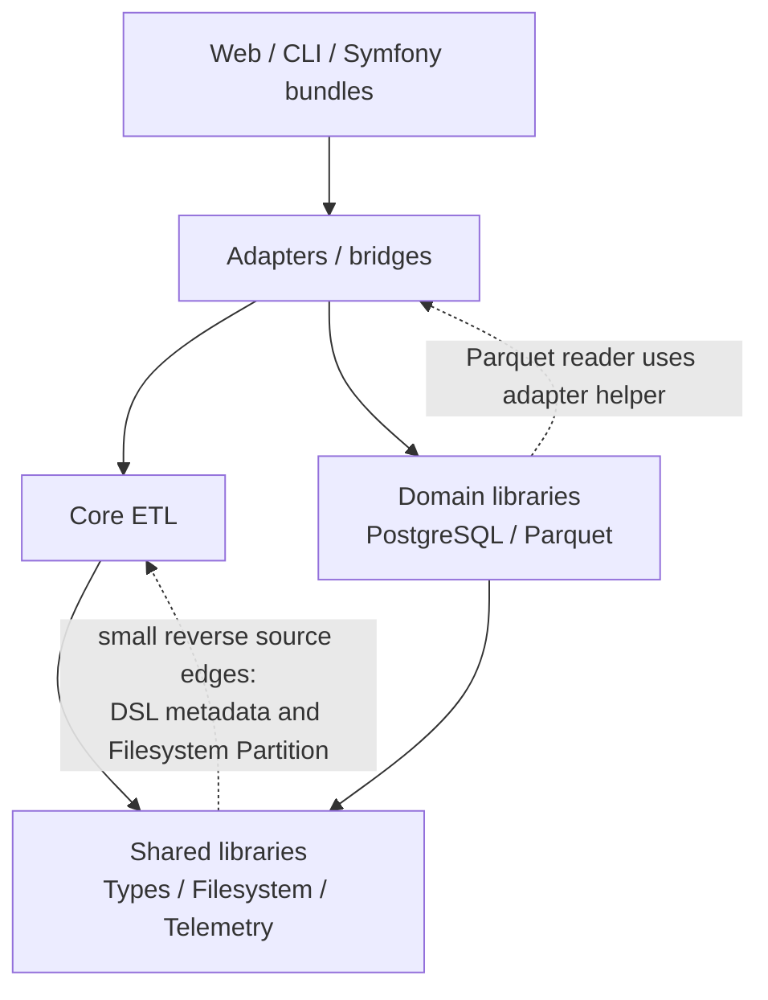

# Flow Repository Map

> Onboarding map synthesized from repository activity and structure during the one-year window ending 2026-06-14. It is not a formal architecture or ownership declaration.

## 1. TL;DR

Flow is a PHP ETL/data-processing monorepo: `flow-php/etl` is the central API and runtime hub, adapters connect it to formats and services, libraries provide types, storage, telemetry, PostgreSQL, and Parquet behavior, and bridges integrate those capabilities with frameworks and protocols. The local Composer runtime graph is acyclic, but source imports reveal small reverse edges from Types, Filesystem, Telemetry, and Parquet into layers that should normally sit above them. Work in the last year was concentrated in PostgreSQL and core ETL, followed by Telemetry, Parquet, and the website/documentation surface; the directory tree alone understates this concentration. PostgreSQL is the main current change territory, while the prominent `src/lib/pg-query` history is a rename trail, not a live package. The most expensive changes are those crossing ETL contracts into adapters, Symfony bundles, serializers, or schema converters. Generated publishing metadata and lock/workflow files often change with many packages, but this is cheaper regeneration/release coupling rather than proof of architectural dependency. For most cross-cutting questions, Norbert Orzechowicz is the first support contact; narrower second lines are listed below.

Solid arrows summarize Composer dependencies; dashed arrows are source-import exceptions found by the lightweight PHP scan.

## 2. Terrain

### Main responsibility zones

- **Core ETL** — `src/core/etl/` owns `DataFrame`, rows, schema, functions, extraction/loading, transformations, joins, cache, retry, and telemetry configuration. It is the deepest dependency hub: 19 local packages depend on it, and almost every adapter sits above it.
- **PostgreSQL platform** — `src/lib/postgresql/` plus the ETL adapter and Symfony/PHPUnit/Valinor bridges cover parser/protobuf AST, query building, schema/catalog, migrations, typed values, and framework integration. It is both the largest current activity zone and a deep subsystem.
- **Shared foundations** — `src/lib/types/`, `src/lib/filesystem/`, and `src/lib/telemetry/` have less visible top-level territory than ETL/PostgreSQL but high fan-in. Changes here can travel through many packages.
- **Parquet stack** — `src/lib/parquet/`, its ETL adapter, and viewer are a narrower but deep reader/writer, Thrift-model, schema-conversion, and IO stack.
- **Integration perimeter** — 14 adapters and 22 bridges are generally thinner than the core libraries, but Symfony PostgreSQL, Symfony Telemetry, OTLP, and the PostgreSQL/Parquet adapters are integration-heavy rather than shallow wrappers.
- **Website and documentation** — `web/landing/` and `documentation/` form a meaningful product surface that often moves with source APIs. Their JavaScript/Twig/runtime dependency graph was not analyzed, so structural coupling here is **unknown**, not absent.

### Activity over time

- 2025 Q2: ETL and Types dominated.
- 2025 Q3: attention shifted to Parquet internals.
- 2025 Q4: PostgreSQL absorbed the former `pg-query` package while ETL stayed active.
- 2026 Q1: website content, ETL, Telemetry, and Parquet led; historical `examples/` activity no longer maps to a live directory.
- 2026 Q2: the densest current cluster became PostgreSQL + ETL, with Telemetry, OTLP, Symfony PostgreSQL, Types, and Parquet close behind.

The important mismatch is between tree shape and work shape: the repository exposes dozens of peer packages, but recent work and dependency pressure converge on a small set of hubs. Conversely, `src/lib/pg-query/`, `documentation/components/libs/pg-query.md`, and `examples/topics/` look important in raw history but do not exist in the current checkout.

## 3. Real Coupling

| Coupling | What actually moves together | Evidence and weight |
| --- | --- | --- |
| ETL ↔ Types | ETL DSL, rows, schema, and functions consume Types extensively; Types DSL imports ETL documentation attributes. | **Import graph:** 357 `core/etl -> lib/types` imports; reverse edge is mostly metadata. High forward runtime coupling, low-cost reverse metadata coupling. **Git:** 28 shared commits. |
| ETL ↔ Filesystem | ETL cache/config uses filesystem APIs; `Filesystem\Partition` imports ETL row/exception concepts. | **Composer + import graph:** real bidirectionality below package level. **Git:** 24 shared commits. Medium change risk, especially partitioning. |
| ETL ↔ Telemetry | ETL runtime uses tracing/metrics; Telemetry DSL imports ETL documentation attributes. | **Import graph:** runtime edge toward Telemetry, reverse metadata edge. Low-to-medium reverse-edge cost; runtime changes still need ETL verification. |
| ETL ↔ adapters | Row, schema, loader, and extractor contract changes propagate through PostgreSQL, Parquet, CSV, JSON, Excel, Doctrine, and others. | **Composer/import graph + git:** adapter/core pairs and triples recur in shared commits. This is real manually edited contract coupling. |
| PostgreSQL ↔ adapter/Symfony bundle | Typed values, query/schema APIs, catalog commands, configuration, and converters span the library and consumers. | **Import graph:** 67 adapter imports and 95 Symfony-bundle imports into PostgreSQL; **git history:** these areas moved together during the current PostgreSQL surge. High integration-test cost. |
| Parquet ↔ adapter | Schema conversion and read/write behavior span ETL, Types, Filesystem, and Parquet; the library reader imports an adapter helper. | **Import graph:** expected adapter-to-library edges plus a surprising reverse edge via `empty_generator`; **git:** ETL + Parquet shared 23 commits. Medium architectural risk. |
| Telemetry ↔ OTLP/Symfony | Signal/pipeline behavior, serialization/export, service wiring, and instrumentation form one end-to-end path. | **Import graph:** 63 OTLP and 152 Symfony Telemetry imports into the Telemetry library; **git history:** the library and bundle are a current co-change cluster. High integration-test cost. |
| Source ↔ docs/website | Public DSL and package behavior often require docs, completions, navigation, and examples to move too. | **Git history only** for cross-surface coupling; the PHP scan did not cover the complete JS/Twig stack. Structural direction is **unknown**. |

There are no local Composer runtime cycles. The practical cycles are source-level: ETL with Types, Filesystem, and Telemetry, plus the Parquet library with its adapter. Most reverse edges are lightweight documentation metadata; `Filesystem\Partition` and Parquet's adapter helper are the exceptions because they carry runtime concepts across the expected boundary.

Repo-wide files need separate interpretation. Root `composer.json` is a true package-boundary denominator. `composer.lock` and `.github/workflows/monorepo-split.yml` commonly move through dependency or release automation. `manifest.json` and `web/landing/resources/dsl.json` appear to be generated/publishing outputs. Their co-change is **regeneration/release coupling**, not evidence that every touched package shares a hand-edited abstraction.

No dependency graph was produced for `web/landing`'s non-PHP code, `documentation/`, `tools/`, extensions, `wasm/`, Docker, or Terraform. Connections inside or across those layers remain **unknown** unless git co-change evidence is stated above.

## 4. Risk Zones

| Zone | Why it is risky |
| --- | --- |
| ETL public DSL and `DataFrame` | Broad public surface, the largest package hub, and heavy Types/Filesystem coupling make local-looking changes propagate widely. |
| PostgreSQL parser, schema, migrations, and DSL | Highest recent activity plus AST/query/schema semantics that feed adapters, bundles, commands, and documentation. |
| PostgreSQL and Parquet adapters | Conversion code sits directly between ETL rows/types and domain-specific values/schema; isolated unit tests do not cover the full contract. |
| Symfony PostgreSQL and Telemetry bundles | Container wiring spans several libraries and bridges; service registration and defaults require integration tests. |
| OTLP Telemetry bridge | Serialization, protocol/generated classes, exporters, and transport behavior create an end-to-end failure surface. |
| Reverse source edges | `Filesystem\Partition` and Parquet's `empty_generator` dependency violate the expected direction and can surprise package-scoped refactors. |

## 5. Who to Ask

These are support candidates inferred from non-merge commits, not formal owners.

| Zone | First contact | Focused second contact |
| --- | --- | --- |
| PostgreSQL platform | Norbert Orzechowicz — parser, query/schema DSL, migrations, converters, adapters, bundles | Joseph Bielawski — Symfony PHP configuration; Jérémy DECOOL — PHPUnit compatibility |
| Core ETL | Norbert Orzechowicz — DataFrame, DSL, rows/schema, cross-adapter contracts | Joseph Bielawski — functions, HTML/XML, parameters, EntryFactory/Rows |
| Parquet stack | Norbert Orzechowicz — reader/writer, schema and adapter architecture | `g` / `gCass` — metadata null counts and the recent round-trip regression |
| Telemetry platform | Norbert Orzechowicz — signals, pipelines, OTLP and framework instrumentation | Joseph Bielawski — serializer/config; Jérémy DECOOL — PHPUnit telemetry; Ben Davies — compiler-pass regex behavior |
| Website/documentation | Norbert Orzechowicz — publishing, navigation, current product narrative | The relevant package contributor; Joseph Bielawski for HTML/DOM documentation |

Before contacting anyone, use `git blame` and inspect the representative commits around the exact file: commit frequency does not prove current responsibility or availability.

## 6. First Day: Read in This Order

1. [`composer.json`](../../composer.json) — understand the aggregate `flow-php/flow` package, split-package replacements, PSR-4 roots, and autoloaded DSL files.
2. [`src/core/etl/src/Flow/ETL/DataFrame.php`](../../src/core/etl/src/Flow/ETL/DataFrame.php) — see the central execution/orchestration API and its Types/Filesystem dependencies.
3. [`src/core/etl/src/Flow/ETL/DSL/functions.php`](../../src/core/etl/src/Flow/ETL/DSL/functions.php) — learn the public functional surface and why changes often touch Types, tests, docs, and autoloading.
4. [`src/lib/types/src/Flow/Types/DSL/functions.php`](../../src/lib/types/src/Flow/Types/DSL/functions.php) — inspect the foundational type DSL and its small reverse dependency on ETL documentation metadata.
5. [`src/lib/postgresql/src/Flow/PostgreSql/DSL/query.php`](../../src/lib/postgresql/src/Flow/PostgreSql/DSL/query.php) and [`schema.php`](../../src/lib/postgresql/src/Flow/PostgreSql/DSL/schema.php) — enter the busiest current subsystem through its query and schema contracts.
6. [`src/adapter/etl-adapter-postgresql/src/Flow/ETL/Adapter/PostgreSql/EntryTypesMap.php`](../../src/adapter/etl-adapter-postgresql/src/Flow/ETL/Adapter/PostgreSql/EntryTypesMap.php) — see how ETL entries, Types, and PostgreSQL typed values meet.
7. [`src/bridge/symfony/telemetry-bundle/src/Flow/Bridge/Symfony/TelemetryBundle/FlowTelemetryBundle.php`](../../src/bridge/symfony/telemetry-bundle/src/Flow/Bridge/Symfony/TelemetryBundle/FlowTelemetryBundle.php) — inspect a representative integration-heavy framework boundary.
8. [`src/adapter/etl-adapter-parquet/src/Flow/ETL/Adapter/Parquet/SchemaConverter.php`](../../src/adapter/etl-adapter-parquet/src/Flow/ETL/Adapter/Parquet/SchemaConverter.php) and [`src/lib/parquet/src/Flow/Parquet/Reader/ColumnDataDecoder.php`](../../src/lib/parquet/src/Flow/Parquet/Reader/ColumnDataDecoder.php) — compare the intended adapter/library split with the known reverse helper edge.

## 7. Limitations

- This map combines repository structure with activity in a one-year window: approximately 2025-06-14 through 2026-06-14. It favors current change territory, not timeless architectural importance.
- Activity counts are changed-file mentions or unique commits depending on the source artifact; neither measures complexity, review effort, code quality, or ownership.
- The package graph comes from Composer runtime requirements. The source graph is a lightweight scan of PHP `use` statements across 2,201 production files in selected active areas, not a resolved AST, call graph, or dynamic-runtime trace.
- The structural scan did not cover the whole stack. Non-PHP website code, documentation tooling/content, infrastructure, extensions, generated protocol code, and other unscanned areas are **unknown**, not disconnected.
- Git co-change shows correlation, not causation. Broad commits, release automation, lockfiles, and regenerated publishing artifacts can inflate apparent coupling; those signals were separated where the artifacts identified them.
- Contributor recommendations reflect authored commits after bot/merge filtering. They do not establish formal ownership, review history, availability, or present team responsibility.
- Renamed or removed paths were folded into their live successors where known: `pg-query` belongs to current PostgreSQL history, while the removed `examples/` tree is historical context only.
